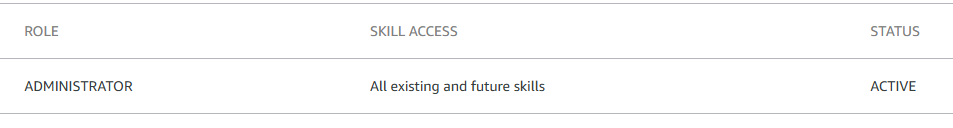

# Music Assistant Alexa Skill Add-on Repository

This repository is a Home Assistant custom add-on repository for provisioning and hosting the Music Assistant Alexa skill.

## Install

1. Add this GitHub repository as a custom add-on repository in Home Assistant.
2. Install `Music Assistant Alexa Skill`.
3. Configure the add-on options.
4. Start the add-on.
5. Open the add-on Web UI and complete `/setup`.

## Requirements

- Home Assistant with Supervisor/add-on support
- An Amazon developer account
- Skill Access Management enabled in the Amazon developer account: [https://developer.amazon.com/alexa/console/ask/settings/access-management](https://developer.amazon.com/alexa/console/ask/settings/access-management)
  
- A public HTTPS endpoint for the Alexa skill (`SKILL_HOSTNAME`)

## Configuration

| Option | Required | Default | Description |
| --- | :---: | :---: | --- |
| `SKILL_HOSTNAME` | Yes | — | Public HTTPS hostname used in the Alexa skill manifest and endpoint validation. |
| `MA_HOSTNAME` | No | — | Public Music Assistant hostname for stream and artwork URL rewriting. |
| `APP_USERNAME` | No | — | Basic-auth username for the add-on UI and API endpoints. |
| `APP_PASSWORD` | No | — | Basic-auth password for the add-on UI and API endpoints. |
| `LOCALE` | No | `de-DE` | Alexa locale used for the skill manifest and interaction models. |
| `AWS_DEFAULT_REGION` | No | `us-east-1` | AWS region used by ASK CLI. |
| `TZ` | No | `America/Chicago` | Timezone for container logs and timestamps. |
| `SKIP_URL_VALIDATION` | No | `false` | Skip outgoing validation of the rewritten Music Assistant stream URL. |

ASK CLI credentials are stored under `/data/.ask` inside the add-on data directory and persist across restarts.

## Repository Layout

- `repository.yaml`: Home Assistant add-on repository metadata
- `addons/music-assistant-skill/`: self-contained add-on source, runtime files, and assets
- `scripts/`: repository maintenance scripts for version sync and checks

## Troubleshooting

### Status Page

Open `/status` from the add-on Web UI to check:
- local API health
- whether ASK CLI credentials are present
- whether the Alexa skill exists and matches `SKILL_HOSTNAME`
- whether testing is enabled in Amazon

### TLS

TLS 1.3 is not supported by the target integration path.

If you use Cloudflare in front of `SKILL_HOSTNAME`, set the minimum TLS version to `1.2`.

## Development Notes

- The add-on image is built from `addons/music-assistant-skill/Dockerfile`.
- GitHub Actions publishes `ghcr.io/jxnlexn/music-assistant-skill`.
- Versioning is driven by `VERSION` and synced into the add-on config.

See [COMPATIBILITY.md](COMPATIBILITY.md), [LIMITATIONS.md](LIMITATIONS.md), and [DISCLAIMER.md](DISCLAIMER.md) for further details.
